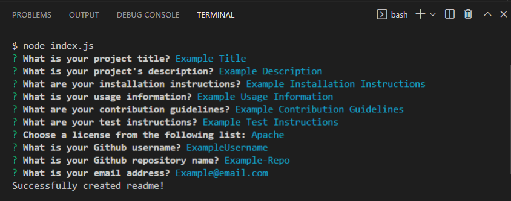
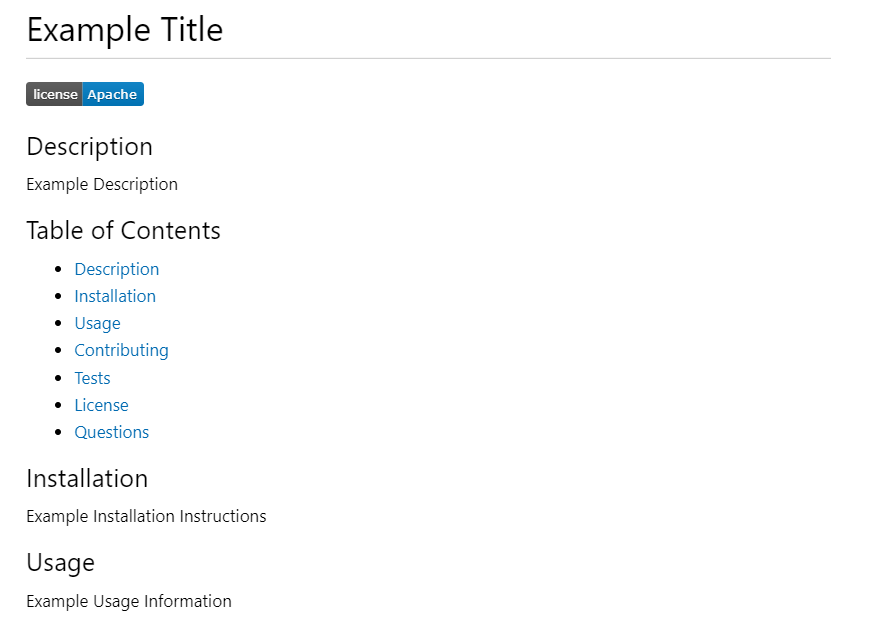

# README Generator

## Application Description
This is a node application which generates a README file from user input. In the terminal, the user is prompted with questions regarding their README such as the title, description, installation instructions, usage information, contribution guidelines, test instructions, license, Github username and repository, and email address. The license badge is displayed near the top of the README, as well as a badge regarding the number of commits to the repository under the repository section.

## Challenge Description
The challenge required using node.js to create a professional readme generator. The node modules that were utilized were inquirer and file system (fs). From the inquirer module, there is a function which prompts the user for input questions as well as one list question for the license selection. From those answers, a function is written to write the README.MD file using the node module fs. In the generateReadme function which writes this file, the object is deconstructed and uses string interpolation to write them into specific places in the README document. The console logs that it was a 'success' to the user.

## User Story

```
AS A developer
I WANT a README generator
SO THAT I can quickly create a professional README for a new 
```

## Acceptance Criteria

```
GIVEN a command-line application that accepts user input
WHEN I am prompted for information about my application repository
THEN a high-quality, professional README.md is generated with the title of my project and sections entitled Description, Table of Contents, Installation, Usage, License, Contributing, Tests, and Questions
WHEN I enter my project title
THEN this is displayed as the title of the README
WHEN I enter a description, installation instructions, usage information, contribution guidelines, and test instructions
THEN this information is added to the sections of the README entitled Description, Installation, Usage, Contributing, and Tests
WHEN I choose a license for my application from a list of options
THEN a badge for that license is added near the top of the README and a notice is added to the section of the README entitled License that explains which license the application is covered under
WHEN I enter my GitHub username
THEN this is added to the section of the README entitled Questions, with a link to my GitHub profile
WHEN I enter my email address
THEN this is added to the section of the README entitled Questions, with instructions on how to reach me with additional questions
WHEN I click on the links in the Table of Contents
THEN I am taken to the corresponding section of the README
```

## Tasks Completed
The JavaScript document includes:
* Functions, Objects, 'const' variables
* Node Modules such as Inquirer and FS (file system)
* String Interpolation
* Comments

## Languages
- JavaScript

## Links
* [Screen Recording of Application](https://link/)

* [Repository](https://github.com/villettec/M9C-Readme_Generator)

## Screenshots




## Credit
Villette Comfort

villette@live.com